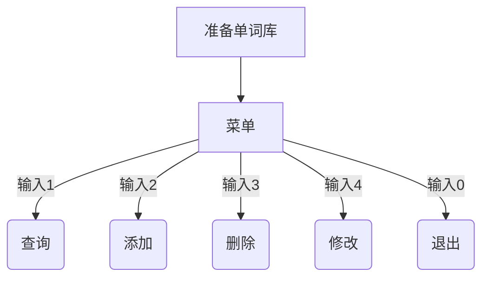
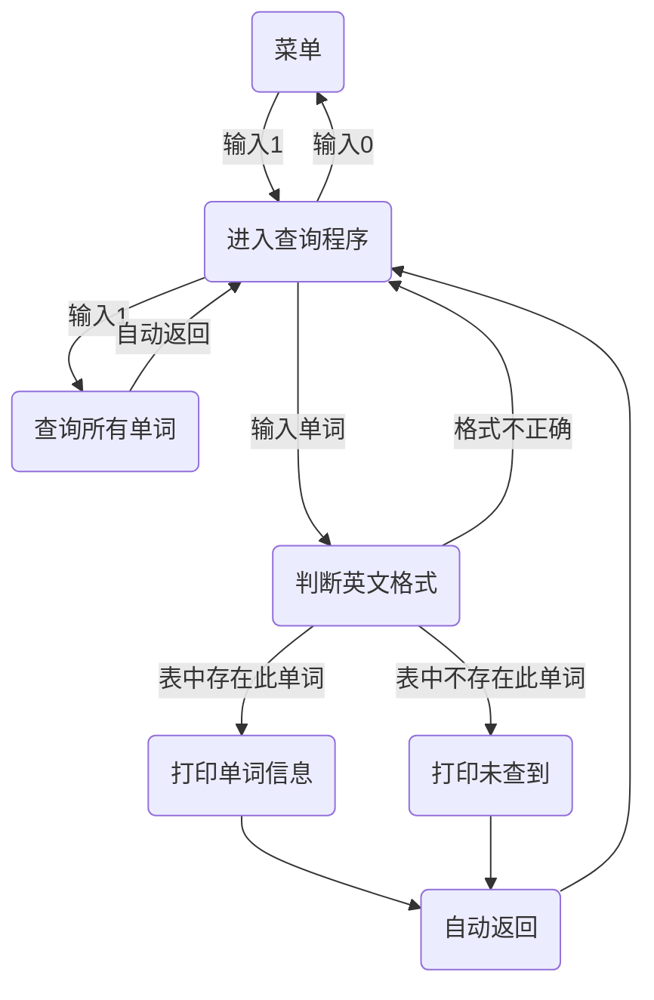
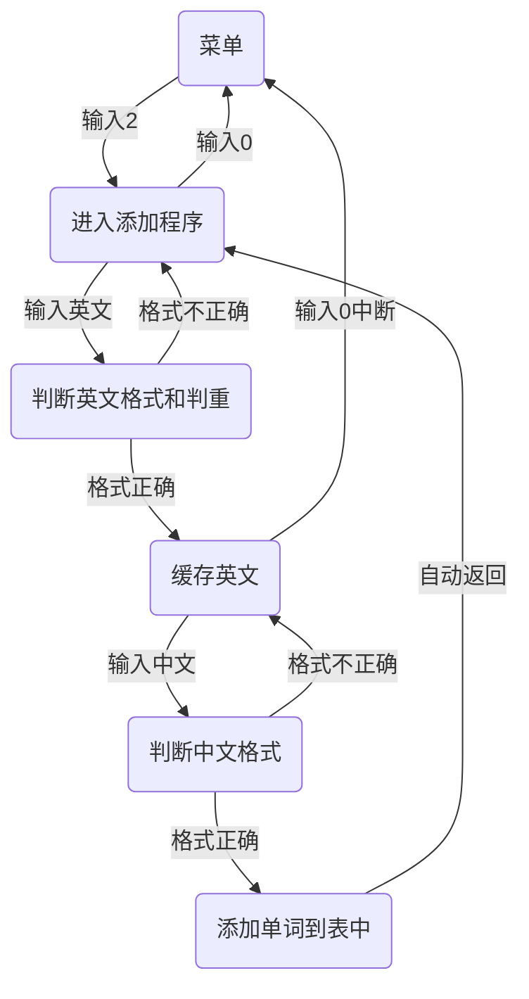
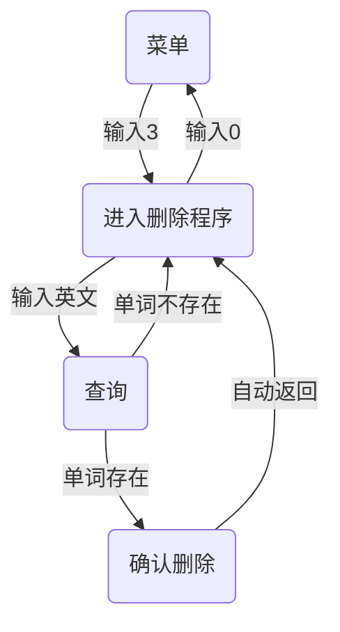
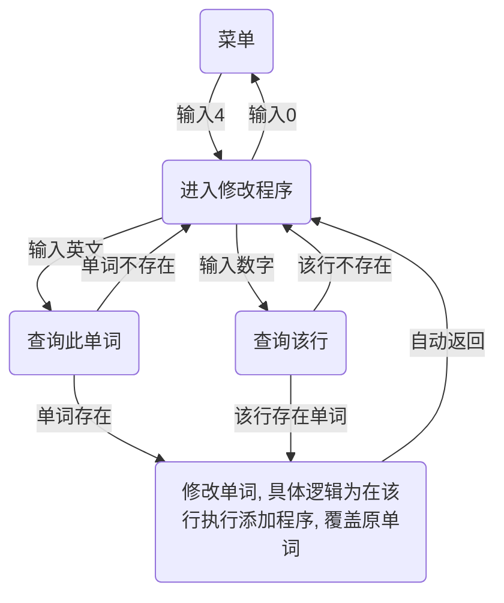

# Introduction
---
本项目基于csv表，模拟维护一个单词库ECmap.csv
单词库中有两列，一列英文一列中文
模拟单词表的增删查改情况。

#  安装流程
---
### 下载python运行环境
---
安装python运行环境（解释器）：
可用教程： [超详细的Python安装和环境搭建](https://blog.csdn.net/qq_53280175/article/details/121107748)
推荐安装Python3.9或以上版本
### 下载项目文件
---

在ftp下载对应压缩包
或在文章末尾ctrl+v

### 依赖库安装
---
打开cmd，切换命令行到本工程所在目录:
> cd clstmeSystem

执行以下命令安装依赖:
>python -m pip install -U pip
>pip install -r requirements.txt

### 运行程序
---
直接点击main.py文件执行，或者进入在cmd中输入
>python main.py

---
# 使用手册
---
本项目功能主要有，菜单，增删查改，退出
其功能相互关系如下图所示。

### 1、菜单
---
在菜单中可以输入数字，实现5个功能：退出，增，删，查，改。

### 2、查询单词
---

### 3、添加单词
---

### 4、删除单词
---

### 5、修改单词
---

### 6、退出程序
---
在菜单界面输入0，退出本程序

# 不足之处
---
1、循环过多，代码冗余且不规范。
2、中英文的格式判断严格，不支持任何符号的输入，且保证英文无重复，导致一词多意时带来的不良体验。
3、还未发现的各种bug。

